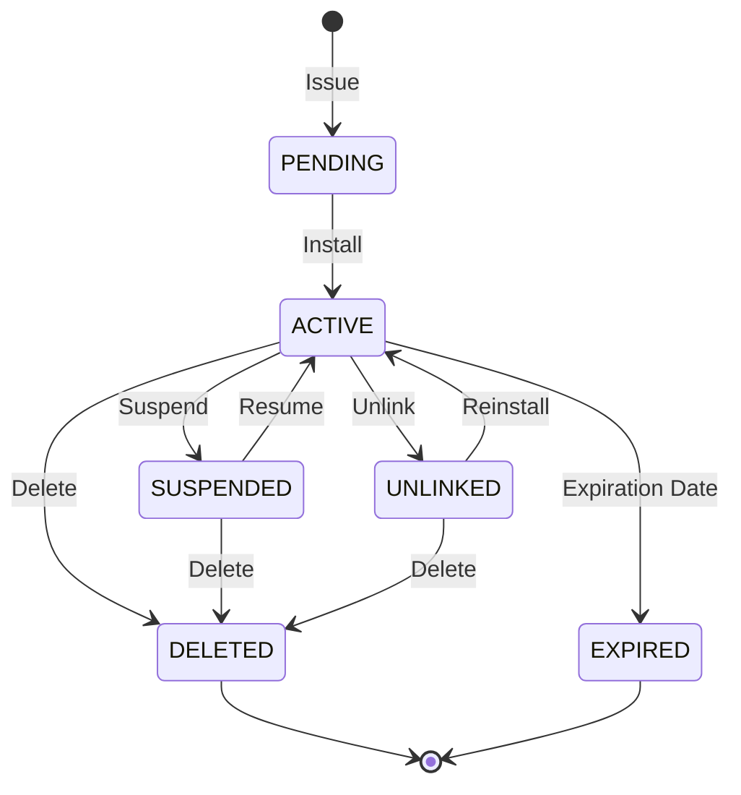

## What is an Access Pass?

An **Access Pass** is a digital credential issued to individuals (employees, guests, students, etc.) that allows them to access physical locations using their mobile device. Access passes are stored in Apple Wallet or Google Wallet and use NFC technology to communicate with access control readers.

## Access Pass Lifecycle

<Steps>
  <Step title="PENDING">
    Access pass has been created but not yet installed on a device
  </Step>
  <Step title="ACTIVE">
    Access pass is installed and functional on the user's device
  </Step>
  <Step title="SUSPENDED">
    Access pass is temporarily disabled (can be resumed)
  </Step>
  <Step title="UNLINKED">
    Access pass has been removed from the device
  </Step>
  <Step title="DELETED">
    Access pass has been permanently deleted
  </Step>
  <Step title="EXPIRED">
    Access pass has passed its expiration date
  </Step>
</Steps>

## Key Properties

### Required Fields

<ParamField path="card_template_id" type="string" required>
  The ID of the card template to use for this access pass
</ParamField>

<ParamField path="full_name" type="string" required>
  Full name of the access pass holder
</ParamField>

<ParamField path="email" type="string" required>
  Email address for notifications and pass delivery
</ParamField>

<ParamField path="site_code" type="string" required>
  Site code for the access control system
</ParamField>

<ParamField path="card_number" type="string" required>
  Unique card number for the access control system
</ParamField>

<ParamField path="start_date" type="datetime" required>
  When the access pass becomes active (ISO 8601 format)
</ParamField>

<ParamField path="expiration_date" type="datetime" required>
  When the access pass expires (ISO 8601 format)
</ParamField>

### Optional Fields

<ParamField path="employee_id" type="string">
  Internal employee or member ID
</ParamField>

<ParamField path="phone_number" type="string">
  Phone number for SMS notifications
</ParamField>

<ParamField path="classification" type="string">
  Classification type (e.g., full_time, part_time, contractor, visitor)
</ParamField>

<ParamField path="title" type="string">
  Job title or role
</ParamField>

<ParamField path="employee_photo" type="string">
  Base64-encoded photo of the pass holder
</ParamField>

<ParamField path="metadata" type="object">
  Custom metadata for your internal use
</ParamField>

## Operations

### Issue an Access Pass

Create a new access pass and send installation instructions to the user:

```javascript
const accessPass = await client.accessPasses.create({
  card_template_id: '0xt3mp14t3',
  full_name: 'Ahmed Al-Mansouri',
  email: 'ahmed@company.com',
  employee_id: 'EMP-001',
  site_code: '123',
  card_number: '45678',
  start_date: '2025-01-01T00:00:00Z',
  expiration_date: '2025-12-31T23:59:59Z',
  classification: 'full_time',
  title: 'Senior Engineer'
});
```

### Update an Access Pass

Modify information on an existing access pass. Updates are pushed to the user's device automatically:

```javascript
await client.accessPasses.update('0xp4551d', {
  title: 'Lead Engineer',
  expiration_date: '2026-12-31T23:59:59Z'
});
```

### Suspend an Access Pass

Temporarily disable access without deleting the pass:

```javascript
await client.accessPasses.suspend('0xp4551d');
```

### Resume an Access Pass

Re-enable a previously suspended pass:

```javascript
await client.accessPasses.resume('0xp4551d');
```

### Delete an Access Pass

Permanently remove an access pass:

```javascript
await client.accessPasses.delete('0xp4551d');
```

## Access Pass States Diagram



## Best Practices

<CardGroup cols={2}>
  <Card title="Expiration Dates" icon="calendar">
    Set reasonable expiration dates and send reminders before expiry
  </Card>
  <Card title="Metadata" icon="database">
    Use metadata fields to store custom data for your application
  </Card>
  <Card title="Suspend vs Delete" icon="trash">
    Use suspend for temporary access removal, delete only when permanent
  </Card>
  <Card title="Monitor State" icon="eye">
    Set up webhooks to track access pass state changes
  </Card>
</CardGroup>

## Related Resources

- [Card Templates](/concepts/card-templates) - Learn about card templates
- [Webhooks](/concepts/webhooks) - Set up event notifications
- [API Reference](/api-reference/access-passes/create) - Detailed API documentation
